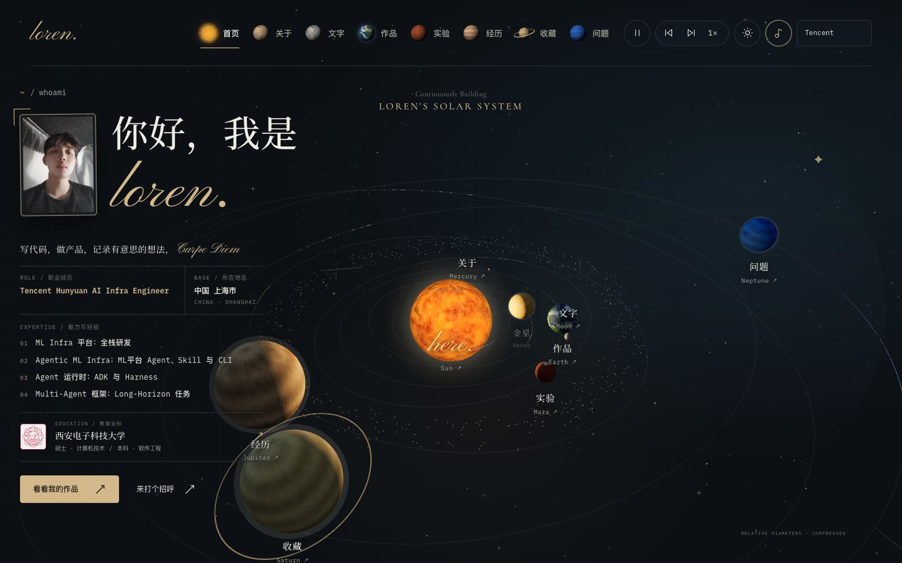
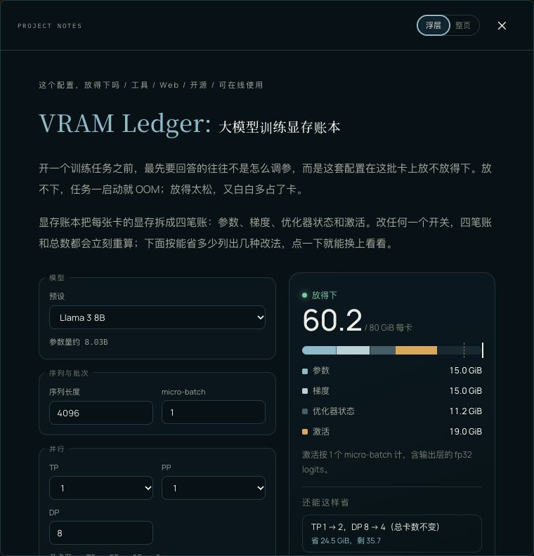

# Loren's Galaxy

[English](README.en.md)



个人主页做成了一套可以飞进去的太阳系。点一颗行星，就进入关于、文字、作品、实验、经历、收藏或问题。作品里有三个能直接用的机器学习基础设施工具：显存账本、checkpoint 间隔计算器、Agent 轨迹回放。几万个个人主页里，这种组合很少见。

A personal site you explore as a solar system, with ML infra tools you can use on the page. [Live site](https://ai-loren.github.io/personal-homepage/) · [English](README.en.md)



HTML、CSS 和原生 JavaScript，没有框架，也没有需要安装的依赖。Node.js 构建只负责裁剪公开履历，产物是纯静态文件，上线不需要运行时后端。

## 一键使用

1. 点 [Use this template](https://github.com/ai-loren/personal-homepage/generate)，建一个自己的仓库。
2. 克隆并打开预览：

```bash
git clone --recurse-submodules https://github.com/<你的用户名>/<仓库名>.git
cd <仓库名>
cp content.example.js content.js
node scripts/site.mjs serve
```

终端会打印预览地址，打开就是示例站。然后改三处：`content.js` 换成你的介绍和作品，`site.config.mjs` 里的 `CAREER_VISIBILITY` 改成 `'all'`（或你某家公司的 `id`），删掉用不到的个人素材（头像、校徽、公司 logo、`assets/projects/`、`data/lab/`、`audio/`，以及 `scripts/content.test.mjs`）。`audio/` 里是有版权的音乐，一定要删。

子模块目录如果是空的，再执行一次 `git submodule update --init`。

3. 仓库 **Settings → Pages → Source** 选 **GitHub Actions**。推到 `main` 之后，网址是 `https://<用户名>.github.io/<仓库名>/`。

页脚的「Built with Loren's Galaxy」欢迎留着。字段、回复区和三个小工具的细项在下一节。

## 用这个模板做你自己的主页

上面的命令能先看到示例站。要发布成你自己的网站，把下面七步做完。

1. **新建仓库**：在 GitHub 上点「Use this template」建一个自己的仓库，再带着子模块克隆：`git clone --recurse-submodules <你的仓库地址>`。
2. **换成你的内容**：`cp content.example.js content.js`，再按下面「换成自己的内容」一节的字段表逐项改。`content.example.js` 留着，通用测试拿它当固定样本。`index.html` 不用改，名字、介绍、职位等会在构建时按 `content.js` 填好。
3. **改履历展示开关**：把 `site.config.mjs` 里的 `CAREER_VISIBILITY` 改成 `'all'`，或者改成你某一家公司在 `content.js` 里的 `id`。
4. **删掉原作者的个人素材和专属测试**：
   - `scripts/content.test.mjs`：只核对原作者那份内容
   - `.harness-e2e/` 下的浏览器测试：按原作者的内容写的，可以删掉或照着改
   - `assets/loren-portrait.webp`、`assets/xidian-university-emblem.png`、各公司 logo、`assets/projects/`、`data/lab/`
   - `audio/`：有版权的音乐，一定要删
   - 用不到的小工具：从 `scripts/site.mjs` 的 `PUBLIC_FILES` 和 `index.html` 里去掉对应脚本；子模块用 `git rm tools/<id>` 移除
5. **问题页的回复区**：
   - 想开回复：给仓库打开 Discussions、安装 [giscus](https://giscus.app/) 应用，把 giscus 页面给出的 `repoId`、`categoryId` 填进 `content.js` 的 `comments`，再把你网站的地址写进 `giscus.json` 的 `origins`。
   - 暂时不开：`categoryId` 留空即可，问题页会显示「正在接入中」。但 `comments.site` 要改成你自己的网址，并和 `giscus.json` 保持一致，测试会检查。
6. **本地验证**：`node --test 'scripts/*.test.mjs' 'tools/*/test/*.test.mjs'`，再 `node scripts/site.mjs serve` 打开预览看一遍。
7. **部署**：仓库 **Settings → Pages → Source** 选 **GitHub Actions**。之后每次推到 `main`，工作流会先测试、再构建，只发布 `dist/`。网址是 `https://<用户名>.github.io/<仓库名>/`。

页脚的「Built with Loren's Galaxy」链接欢迎保留；觉得有用，给 [原仓库](https://github.com/ai-loren/personal-homepage) 点个 star。代码是 MIT 许可，原作者的个人内容、商标和音乐不在其内，见 [CONTENT-LICENSE.md](CONTENT-LICENSE.md)。

## 本地启动

需要 Node.js 20+ 和现代浏览器，不需要 `npm install`。预览入口会先裁剪公开数据，再仅服务允许发布的文件；**不要再从源码根目录运行 `python3 -m http.server`**，否则完整履历、测试文件和 Git 元数据可能被直接读取。

在项目根目录执行：

```bash
node scripts/site.mjs serve
```

看到 `Preview: http://127.0.0.1:4177/` 后打开该地址。页面上显示哪些公司的履历，由 `site.config.mjs` 的 `CAREER_VISIBILITY` 决定，浏览器收到的数据也只有这些公司的。本仓库当前只发布 Tencent，控件不可展开。

- **停止服务**：在运行服务的终端按 `Ctrl+C`。
- **更新页面**：修改源码或 `site.config.mjs` 后，停止并重新执行启动命令，再刷新浏览器。服务只使用启动时生成的公开快照，没有自动热更新。
- **连接被拒绝**：确认启动成功、终端保持运行，浏览器端口与启动端口一致。
- **端口占用**：先停止旧服务；也可执行 `node scripts/site.mjs serve --port 4178` 并访问 <http://127.0.0.1:4178/>。不要让旧的源码目录服务继续运行。
- **只生成发布文件**：执行 `node scripts/site.mjs build`，结果在 `dist/`。重新构建会清理此前生成的目录，避免留下旧模式数据或 Logo；不识别的目录会拒绝覆盖。

如果使用其他静态服务器，只能把 `dist/` 设为网站根目录。不要直接打开源码 `index.html`，也不要发布整个仓库。

## 换成自己的内容

编辑源码 `content.js` 后重新启动预览，或重新构建并部署 `dist/`。不要直接编辑 `dist/content.js`，它会在下次构建时被覆盖：

| 配置 | 用途 |
| --- | --- |
| `profile.name` | 首页、站点标识和页脚上的名字 |
| `profile.siteTitle` | 首页浏览器标题 |
| `profile.intro` / `description` | 简短介绍 / 详细介绍 |
| `profile.motto` | 首页介绍句末尾的金色书法短语；留空时介绍句以句号结尾 |
| `profile.now` / `nowNote` | 首页「此刻」内容 |
| `profile.email` | 联系邮箱；留空时显示未提供联系方式 |
| `profile.github` | 完整 GitHub 主页地址；留空时隐藏入口 |
| `profile.focus` | 首页「能力与经验」列表；留空时整块不显示 |
| `profile.location` / `locationEn` | 首页所在地区（中文 / 英文） |
| `profile.portrait` | 首页头像 `{ src: './assets/<文件名>', alt }`；不填就不显示头像 |
| `profile.demo` | 为 `true` 时实验页底部显示「当前实验数据为模拟示意」；实验换成真实数据后改为 `false` |
| `experience` | 工作经历，每家公司一项：`id`（小写字母、数字或连字符，用作展示开关的取值）、`company`、`modeName`（切换菜单上的名字）、`privateMarkers`（不发布这家公司时，任何公开文件里都不许出现的词，比如英文名、内部项目代号）、`profileRole`、`logo`、`roles`。`modeName` 和 `privateMarkers` 只给构建用，不会发布 |
| `journey` | 教育经历；每项可带 `emblem: { src, alt }` 校徽，首页显示第一项的校徽 |
| `articles` | 文章，按展示顺序排列；第一篇显示在首页 |
| `projectFacets` | 作品筛选的维度与可选值（类型、使用、代码），作品只能用这里声明的值 |
| `projects` | 项目介绍、筛选维度取值、技术标签及外部链接 |
| `ideas` | 「问题」栏：还在想的开放问题，按展示顺序排列（栏目 id 仍为 `ideas`） |

文章与项目的 `body` 支持 `p`（段落）、`h3`（小标题）、`quote`（引用）、`ul`（列表）、`links`（参考链接，`items: [{ text, url }]`；`url` 写成 `#lab/goodput` 这种形式就是站内链接）和 `tool`（站内小工具，`tool: "<工具 id>"`）。正文按纯文本渲染，不解析 HTML 或 Markdown。

每篇文章、每个项目的 `id` 应当唯一，推荐使用英文短横线，例如 `my-first-post`。文章链接形如 `#writing/my-first-post`，可以直接打开、刷新、使用浏览器前进后退。

项目的 `url` 是演示地址，`source` 是源码地址，均使用完整的 `https://...` URL；留空就不会出现相应按钮。`artwork` 支持 `browser`、`timer`、`notes`、`terminal`、`ledger`、`checkpoint`、`trace` 七种 CSS 示意图。

`index.html` 不需要手改：标题、描述、名字、介绍、职位、地区、能力列表、头像、学历和「此刻」都写成 `{{name}}` 这样的占位符，头像、学历、校徽这类可选内容包在 `<!-- if:portrait -->…<!-- end:portrait -->` 里，构建时按 `content.js` 填好或整块去掉。这样禁用 JavaScript 的访客和搜索引擎看到的首屏，与页面加载后渲染的是同一份资料。

## 职业经历展示开关

唯一开关是 `site.config.mjs` 中的 `CAREER_VISIBILITY`。它只在构建/启动预览时读取，不会发给浏览器，也不接受 URL、存储或 HTTP 参数覆盖。

| 开关值 | 生成的公开内容与控件 |
| --- | --- |
| 某家公司的 `id` | 只包含这家公司的履历及图片，右上角固定显示它的 `modeName`，不可展开 |
| `all` | 包含 `experience` 里的全部公司，显示「全部履历」加各公司名的切换菜单 |

公司名单和菜单上的名字都来自 `content.js`，代码里不写死任何公司。填了 `content.js` 里没有的 `id` 会直接报错，并列出可用的值。

**本仓库的情况**：当前开关是 `'tencent'`，暂不开放 `all` 和 `bytedance`。相关源数据、图片、筛选逻辑和交互测试完整保留，后续确认开放时只需修改开关，再重新构建并部署。`all` 模式下的菜单选择仅在本次页面生命周期内有效，不写入存储，刷新回到构建默认值。

完整数据仍在源码 `content.js` 的 `experience` 中维护。首页与关于的职位由公司 `profileRole` 派生；教育和其他栏目不受影响。构建会生成裁剪后的 `dist/content.js`，未开放公司的数据和 Logo 不进入 `dist/`；其他公开文件若残留该公司的名字、职位、`privateMarkers` 里的词或整句工作亮点，构建会报错而不是继续发布。非法开关同样直接报错，不回退为全部公开。

展示范围不改变实际任职状态：Tencent 及 Hunyuan 岗位时间为 2026.09 — 至今，ByteDance 及 Seed 岗位均于 2026.09 结束。尚未提供的 Tencent 职责和技能留空，不推算或编造；缺少日期时不显示时长。补充日期使用 `YYYY-MM` 格式，当前岗位由 `current: true` 标识。公司结束月份仅在所有历史岗位结束月份已知时计算，避免把 Ads 结束日期误当成 ByteDance 离职日期。Tencent/Hunyuan 使用 `assets/tencent-logo.png` 和 `assets/tencent-hunyuan-logo.png`，通过 `logo` 和 `logoAlt` 配置；两张透明 PNG 分别来自[腾讯官方媒体库](https://www.tencent.com/en-us/media/library.html)和[混元官方仓库](https://github.com/Tencent/Tencent-Hunyuan-Large)，与选定的参考图版本一致，页面不依赖外链图片。

**安全边界是“不发送未公开数据”，不是让浏览器代码无法修改。**访客可以修改自己的页面文字或 JavaScript，但不能从 Tencent 公开文件中还原未发布的履历。预览仅服务文件白名单；README、测试、构建配置、Git 元数据、未公开 Logo 和源码备份均不可通过预览 URL 访问。服务返回 `Cache-Control: no-store`，修改查询参数也只会得到同一份裁剪数据。

**网站只部署 `dist/`，但源码仓库目前按维护者决定保持公开。**完整履历仍可通过 GitHub 源码与历史查看；网站的数据裁剪只控制 Pages 站点展示和下载内容，不代表源码保密。如果以后需要真正限制完整履历的获取，需另行将源仓库私有化并处理旧发布、历史和缓存。

### 测试

运行 `node --test 'scripts/*.test.mjs' 'tools/*/test/*.test.mjs'`，不需要安装额外依赖：

- `scripts/site.test.mjs`：通用的发布与安全检查，比如只发布选中的公司、其他公司的信息漏进公开文件就报错、首页占位符转义、路径遍历、私有文件拒绝访问、严格的 CSP。它不依赖某一个人的内容，用 `content.example.js` 当固定样本，换了内容也应该通过。
- `scripts/content.test.mjs`：只核对本仓库这份内容，比如锁定 Tencent、字节跳动的信息不外泄、三个小工具。用这个仓库做模板时删掉。
- `scripts/vram-ledger.test.mjs` 和 `tools/*/test/`：三个小工具各自的公式测试。

浏览器回归测试是按本仓库的内容写的。

浏览器回归使用固定版本 Playwright CLI。保持安全预览服务运行，再在项目根目录执行：

```bash
npx --yes --package=@playwright/cli@0.1.21 playwright-cli install-browser chromium
npx --yes --package=@playwright/cli@0.1.21 playwright-cli -s=career-tests open http://127.0.0.1:4177/ --config=.harness-e2e/cli.config.json
npx --yes --package=@playwright/cli@0.1.21 playwright-cli -s=career-tests run-code "$(cat .harness-e2e/career-locked.js)"
npx --yes --package=@playwright/cli@0.1.21 playwright-cli -s=career-tests run-code "$(node .harness-e2e/unlocked-fixture.mjs)"
npx --yes --package=@playwright/cli@0.1.21 playwright-cli -s=career-tests run-code "$(cat .harness-e2e/ufo-controls-reach.js)"
npx --yes --package=@playwright/cli@0.1.21 playwright-cli -s=career-tests run-code "$(cat .harness-e2e/writing-pagination.js)"
npx --yes --package=@playwright/cli@0.1.21 playwright-cli -s=career-tests run-code "$(cat .harness-e2e/question-replies.js)"
npx --yes --package=@playwright/cli@0.1.21 playwright-cli -s=career-tests run-code "$(cat .harness-e2e/background-music.js)"
npx --yes --package=@playwright/cli@0.1.21 playwright-cli -s=career-tests run-code "$(cat .harness-e2e/detail-mode.js)"
npx --yes --package=@playwright/cli@0.1.21 playwright-cli -s=career-tests run-code "$(cat .harness-e2e/project-facets.js)"
npx --yes --package=@playwright/cli@0.1.21 playwright-cli -s=career-tests run-code "$(cat .harness-e2e/vram-ledger.js)"
npx --yes --package=@playwright/cli@0.1.21 playwright-cli -s=career-tests run-code "$(cat .harness-e2e/ckpt-goodput.js)"
npx --yes --package=@playwright/cli@0.1.21 playwright-cli -s=career-tests run-code "$(cat .harness-e2e/agent-trace-replay.js)"
npx --yes --package=@playwright/cli@0.1.21 playwright-cli -s=career-tests close
```

`career-locked.js` 检查真实公开响应，尝试修改 DOM、全局配置、URL、存储及客户端策略，验证不能恢复未下发的履历；同时检查 Tencent 图片、时间、响应式和阅读功能。验证线上时，将浏览器打开地址替换为 `https://ai-loren.github.io/personal-homepage/`，运行同一个脚本即可；它支持项目子路径，仅对本地预览断言 `Cache-Control: no-store`，GitHub Pages 的 CDN 缓存策略由平台管理。

`unlocked-fixture.mjs` 仅将完整数据与图片注入隔离测试浏览器，不写入 `dist/`，不开放额外 HTTP 路径，不修改真实开关。它复用 `career-modes.js` 验证保留的三模式、鼠标/键盘、路由与搜索状态、日期边界、320–1440px 菜单布局和深浅主题。原有 ByteDance 桌面/移动端 YAML 契约作为历史模式基线保留，不用于验收当前 Tencent 锁定发布。

## 功能

- 本地化字体体系：书法品牌字、高对比英文衬线体、中文宋体展示字、现代无衬线正文与等宽技术标签。
- 首页和七个独立栏目：关于、文字（工作、人生、技术、随想四类）、作品、实验、经历、收藏、问题。
- 个人太阳系导航：水星对应关于、月球对应文字、地球对应作品、火星对应实验、木星对应经历、土星对应收藏、海王星对应问题；金星和天王星作为完整太阳系的背景天体。
- 文章分类、标题/摘要/正文搜索、分页（每页 6 / 10 / 20 条，默认 10 条；切换分类或搜索时回到第 1 页）及阅读窗口。
- 实验记录：卡片显示关键指标对比与缩略曲线，详情页含假设、设置、指标、SVG 折线图/条形图、发现与结论；图表随页面主题配色，数据写在 `content.js` 的 `experiments` 中（当前为模拟示意）。每个实验带若干份可下载的 CSV（`data/lab/<实验 id>/`），`content.js` 里的 `datasets` 记录说明、行数、字节数与逐列含义；构建只发布 `datasets` 列出的文件，`scripts/site.test.mjs` 校验表头、行数、字节数和首行与描述一致，改了 CSV 要同步改描述。
- 作品筛选：按 `projectFacets` 每个维度一排（类型 / 使用 / 代码），每排有自己的「全部」，各排同时生效。「使用」是多选维度，一个作品可以同时是 Web、CLI、SDK。按钮只列出至少有一个作品用到的值，只剩一个值的维度整排不显示，会让结果变空的选项被禁用。构建会拒绝 `projectFacets` 里没有声明的值，加新取值先在那里声明。
- 站内小工具：作品正文里的 `{ type: 'tool', tool: '<id>' }` 会挂载注册在 `window.SITE_TOOLS['<id>']` 上的工具，脚本放在 `tools/<id>.js` 或子模块里的 `tools/<id>/<id>.js`。新增工具要做三件事：放好脚本、把它加进 `scripts/site.mjs` 的 `PUBLIC_FILES`、在 `index.html` 里于 `app.js` 之前加 `<script>`；构建会拒绝正文里引用了未发布的工具 id。工具纯前端运行、不联网，输入只按数值处理。目前有三个，代码都在各自的仓库里：
  - 显存账本（VRAM Ledger，[ai-loren/vram-ledger](https://github.com/ai-loren/vram-ledger)）：`tools/vram-ledger.js` 是正本的逐字节复制件。改它要先在那个仓库里改、跑通测试，再用 `cp ../vram-ledger/vram-ledger.js tools/` 复制过来，提交时写明对应的上游 commit；`scripts/vram-ledger.test.mjs` 核对它的公式。
  - checkpoint 间隔计算器（Ckpt Goodput，[ai-loren/ckpt-goodput](https://github.com/ai-loren/ckpt-goodput)）和 Agent 运行轨迹回放器（Agent Trace Replay，[ai-loren/agent-trace-replay](https://github.com/ai-loren/agent-trace-replay)）：以 git 子模块挂在 `tools/ckpt-goodput`、`tools/agent-trace-replay`，本仓库只记录它们的 commit，不存它们的代码，构建时只发布各自的那一个 JS 文件。克隆时用 `git clone --recurse-submodules`，已经克隆的跑一次 `git submodule update --init`，否则构建会报缺文件并给出这条命令。升级到新版本：`git -C tools/<id> pull`，跑过测试后提交子模块指针。Pages 工作流会连子模块一起检出，并在构建前跑它们自带的 `test/<id>.test.mjs`。

  计算公式与假设写在各自的作品详情里。显存账本和 checkpoint 计算器共用表单、结果面板、图例和改法按钮的样式（`styles.css` 里 `.vram-*, .ckpt-*` 并列的规则）；轨迹回放的样式是 `.trace-*`。轨迹回放把粘贴进来的内容只用 `textContent` 写进页面，`.harness-e2e/agent-trace-replay.js` 会贴一段带 `` 和 `<script>` 的轨迹，确认它们只显示成文字。
- 详情展示方式：作品、文字、实验、问题的详情顶部有「浮层 | 整页」切换，选择存在 localStorage，默认浮层。整页模式在站内显示（保留页头导航），网址与浮层相同，「← 返回」或 Esc 回到列表并恢复原滚动位置。两种模式共用同一份 `#reader-shell`，切换时整体移动，所以页面里 `#reader-*` 与 `#question-replies` 始终只有一份。
- 背景音乐：页头右上角的音符按钮打开面板，可开关背景音乐（音符 / 斜线音符）和调音量，曲目在 `content.js` 的 `music.tracks` 中按顺序循环。进入页面时默认以 50% 音量尝试自动播放；浏览器禁止无手势自动出声时（多数浏览器的默认策略），改为在访客第一次点击、触摸或按键时开始。访客主动关闭后不再自动播放，开关和音量存在 localStorage。当前曲目是受版权保护的电影原声，未取得授权，面板底部有版权声明和联系方式；收到版权方要求时，删除 `audio/` 下的文件并改写 git 历史、强制推送才能彻底移除（构建时缺文件的曲目会被移出播放列表，全缺则隐藏音乐控件）。
- 问题回复：每个问题点开后有独立回复区，由 giscus（GitHub Discussions）承载，访客登录 GitHub 后回复，按 `question:<问题 id>` 对应讨论帖。回复只以 giscus.app 的跨域 iframe 嵌入（带 sandbox），本站不执行第三方脚本或样式；`index.html` 的 CSP 只放行本站资源与 `frame-src https://giscus.app`，因此页面里不能写内联脚本、事件属性或 style 属性，CSS 变量要用 `element.style.setProperty` 设置。`content.js` 的 `comments.categoryId` 为空时回复区只显示「正在接入中」，不加载任何外部内容。`giscus.json` 只放行 `comments.site` 的域名（测试会校验两者一致），在其他域名（含本地预览）打开时回复区不嵌入 giscus，只给出跳到正式网站同一问题的链接；要在本地测试回复，需临时把本地地址加进 `giscus.json` 的 `origins` 并推送。问题 id 一旦发布不要改，否则旧回复会和问题脱钩。
- 项目筛选、详情及可选的源码/演示链接。
- 深浅色模式，记住浏览器中的主题选择。
- 手机导航、键盘操作、Escape 关闭弹窗与减少动效支持。
- 联系邮箱、复制邮箱、可选 GitHub 入口。
- 带地形、独立云层、大气辉光、月面凹凸和固定光照的旋转星球，以及星球导航图标。
- 太阳使用独立 Canvas 绘制日面颗粒、日斑、等离子亮弧，并叠加旋转日冕和两组耀斑。
- Canvas 星点闪烁、鼠标视差和流星；右上角支持暂停，非首页、离屏和后台标签页停止动画。
- 行星默认尺寸按真实直径关系做压缩映射：木星 > 土星 > 天王星 ≈ 海王星 > 地球 ≈ 金星 > 火星 > 水星 > 月球。太阳单独压缩，避免遮挡整个导航。
- 鼠标悬停或键盘聚焦天体时，天体放大并加速自转，对应轨道高亮，同时显示实际直径。
- 首页太阳系优先使用 Three.js 透视场景：轨道具有倾角与景深，行星会公转、自转并发生前后遮挡；鼠标移动会产生相机视差。Three.js 或 WebGL 不可用时自动保留二维 Canvas 版本。
- 七个栏目使用独立 Canvas 背景叙事：水星观测网格、月相星图、地球与卫星、火星地貌、航行轨迹、土星档案网格、古星图黑洞；深浅模式各有对应配色。

`cosmos.js` 在浏览器中生成各天体的程序纹理，`globe-renderer.js` 使用 WebGL 为地球和月球进行球面投影与片元光照；不支持 WebGL 时自动退回 Canvas。大陆轮廓和月面为艺术化纹理，不是卫星照片或精确地图。其余行星使用轻量 Canvas 渲染，导航小图标复用对应天体的静态球面。

所有视觉效果均为本地 Canvas / CSS 绘制，没有外部图片、字体、追踪器或 API 请求。除保存主题、动效偏好外，不存储访客数据。系统启用「减少动态效果」时保持静态展示。

## 部署

先运行 `node scripts/site.mjs build`，构建成功后**仅发布 `dist/` 的内容**，不要把它追加到仍包含旧源码文件的目录。`dist/` 已包含页面、裁剪后的数据、获准使用的图片、Three.js r160、字体及许可证。原始 `assets/` 是长期源资源，不可删除；仅未获准公开的公司图片不会被复制到产物。

- **Cloudflare Pages / Netlify / Vercel**：使用 Node.js 20+，构建命令设为 `node scripts/site.mjs build`，输出目录设为 `dist`。关联源仓库时保持源仓库私有。
- **GitHub Pages**：仓库 **Settings → Pages → Source** 必须设为 **GitHub Actions**。`.github/workflows/pages.yml` 在推送到 `main` 或手动触发后，用 Node.js 24 运行发布隔离测试、执行与本地相同的构建命令，再只上传 `dist/` 并部署。测试或构建失败不会发布。可在 **Actions → Deploy GitHub Pages** 查看构建与部署状态；不要改回 `main` 根目录分支部署。
- **手工上传**：用新 `dist/` 完整替换公开目录，确认 README、Git 元数据、脚本、测试、备份及旧公司 Logo 均不存在。构建失败时停止发布，不使用遗留产物继续上线。

本站仍使用 hash 路由，不需要服务端重写规则，也可放在子目录中。上述托管设置需在平台上实际应用；修改本地代码不会自动调整已有线上部署。

当前实现适合个人展示与本地文件维护。如果之后需要留言、订阅、跨设备在线编辑，需另接相应服务。每篇文章的独立搜索引擎收录与分享预览，可以在后续通过静态站点生成器实现。

## 许可证

代码采用 [MIT](LICENSE) 许可。`content.js` 里的个人内容、照片、作品截图、实验数据，各公司与学校的商标，以及背景音乐都不在 MIT 范围内；字体、three.js 和三个小工具保留各自的许可。详见 [CONTENT-LICENSE.md](CONTENT-LICENSE.md)。

觉得有用，请给这个仓库点个 [star](https://github.com/ai-loren/personal-homepage/stargazers)。
